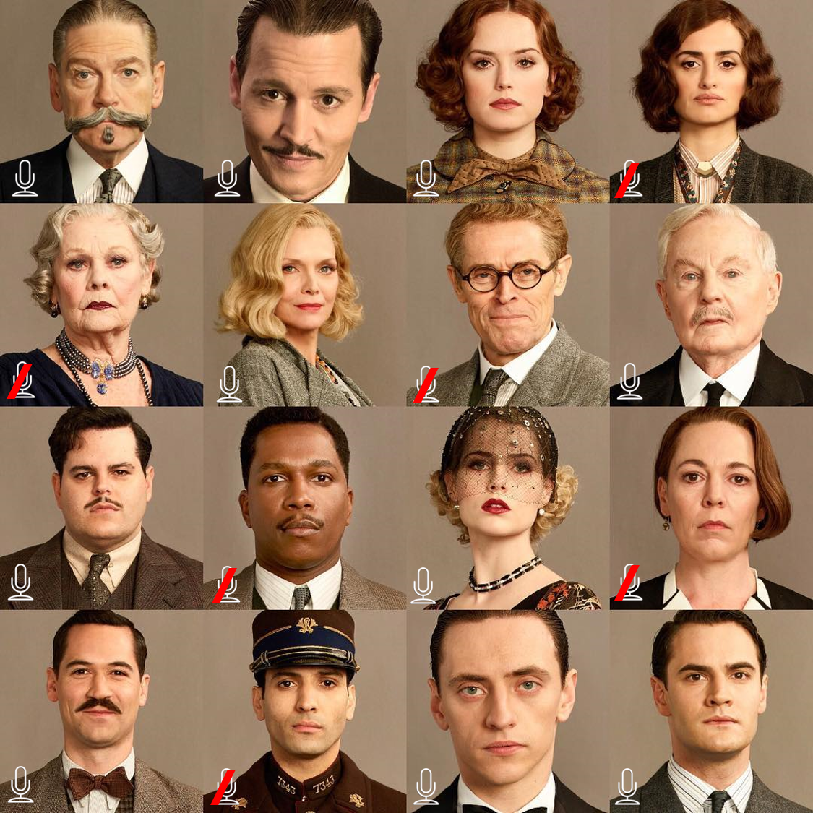

In the first workshop module you will learn how to access Amazon Rekognition using the fabulous [paws package](https://github.com/paws-r/paws), an AWS SDK for R.

[Amazon Rekognition](https://aws.amazon.com/rekognition/) is a service for image and video analysis which comes with pre-trained deep learning models and a simple API which makes it easy for developers to add these analytics capabilities to their applications.  

Some of Amazon Rekognition's features include:

* Object and scene detection
* Image moderation (checks if the image content is appropriate)
* Facial analysis
* Celebrity recognition
* Face comparison (looking for a facial match in an image based on a single training photo)
* Text in image (e.g. useful to analyze text in posted social media images which are usually inaccessible for filters)

In the examples below we will focus on how Rekognition's “text-in-image” and “face comparison” features work using R. Following along it will be easy for you to apply your new knowledge to using the other features later on your own. 

But first we need to make sure that our setup is complete.

## Prerequisites

Please have another look at the prerequisites section in the README. It is essential that you have an IAM user with programmatic access to the AWS API and that you saved the user's access key ID and secret access key as R environment variables.

Using AWS Rekognition following the examples below should come at no cost. As of creating this workshop module the service is part of AWS Free Tier, which lasts 12 months and allows you analyze 5,000 images per month and store 1,000 pieces of face metadata per month.


## Some additional information about the API

You have two options to pass images for their analysis to Rekognition's API endpoints. Either you pass the images as references to images already uploaded in an Amazon S3 bucket. Or you pass the images as raw bytes which means that the images need to reside in your computer's memory. 

**Important**: Both the paws documentation and the boto3 (official AWS SDK for Python) documentation mention to pass the images as base64-encoded images and not as raw bytes. Unfortunately, it seems that the documentation is not correct in either case because passing base64-encoded images in R did not work for me. [This Stack Overflow post](https://stackoverflow.com/questions/47542341/how-do-i-convert-local-jpg-file-to-base64-to-work-with-boto3-and-detect-text), where someone had the same issue in Python using boto3, made me switch successfully to passing raw bytes instead. So just make sure to think "raw bytes" every time you read "base64-encoded" in the paws or boto3 documentation of the Rekognition API.

OK, enough talking! Let's get started. 

## Loading the necessary libraries

First, we load the necessary libraries: Using `paws` is a no-brainer here. We will use `purrr`'s magic and `tibble` to parse the responses of our API requests. We will use `readr` primarily to read binary data of image files and `magick` to add Bounding Boxes to images after having received their coordinates via an API response. 

```{r message=FALSE }
library(paws)
library(purrr)
library(tibble)
library(readr)
library(magick)
```


## Creating an S3 bucket 

First we need to create an S3 bucket to which we will upload our image files. We'll create an S3 client and check if any buckets already exist in the region you specified in the `.Renviron` file:

```{r}
# Create S3 client
s3 <- s3()
# Let us check if there is an S3 bucket we could use
buckets <- s3$list_buckets()
length(buckets$Buckets)
```
In case you just got started using AWS, there should not be any S3 bucket yet available. Otherwise, you might have already created some buckets. For this tutorial, we will create a new S3 bucket. Make sure to specify a globally unique bucket name below:

```{r}
bucket_name <- "[YOUR-GLOBALLY-UNIQUE-BUCKET-NAME]"
```

By default, the bucket is created in the us-east-1 (N. Virginia) Region when calling `create_bucket`. You can optionally specify another region in the request body via the `LocationContraint` parameter. 

```{r}
s3$create_bucket(Bucket = bucket_name,
                   CreateBucketConfiguration = list(
                     LocationConstraint = "eu-central-1"))
buckets <- s3$list_buckets()
buckets <- map_df(buckets[[1]], 
                  ~tibble(name = .$Name, creationDate = .$CreationDate))
buckets
```

## Text-in-image detection

The first feature we will test is text detection in images. This will be our test image:

<p align="center">
```{r echo=FALSE, out.width = "40%"}
knitr::include_graphics("./images/tyrion_quote.jpg")
```
</p>

As explained above there are two ways to feed a Rekognition endpoint with image data: By referencing images residing in an S3 bucket or by sending the image as raw bytes. Let us check out both options.

### Option 1: Referencing an image

Let us upload the image to the S3 bucket we just created.

```{r}
s3$put_object(Bucket = bucket_name, 
              Body = read_file_raw("./images/tyrion_quote.jpg") , 
              Key = "tyrion_quote.jpg")
```

OK, that response from the endpoint acknowledging the upload looks rather cryptic. Let us check if our test image now really resides in our bucket.

```{r}
bucket_objects <- s3$list_objects(bucket_name) %>% 
  .[["Contents"]] %>% 
  map_chr("Key")
bucket_objects
```

Perfect, everything worked as expected and our test file was uploaded successfully. Next, we need to create a Rekognition client for making the necessary API calls:

```{r}
# Create a Rekognition client
rekognition <- rekognition()

# Referencing an image in an Amazon S3 bucket
resp <- rekognition$detect_text(
  Image = list(
    S3Object = list(
      Bucket = bucket_name,
      Name = bucket_objects
    )
  )
)

# Parsing the response
resp %>% 
  .[["TextDetections"]] %>% 
  keep(~.[["Type"]] == "WORD") %>% 
  map_chr("DetectedText")
```

Hurray! We used Rekognition the first time and the service delivered the correct results. What about sending the image in raw format instead? 

### Option 2: Sending the image as bytes

```{r}
image <- read_file_raw("./images/tyrion_quote.jpg")

# Sending the image as raw bytes
resp <- rekognition$detect_text(
  Image = list(
    Bytes = image
  )
)

# Parsing the response
resp %>% 
  .[["TextDetections"]] %>% 
  keep(~.[["Type"]] == "WORD") %>% 
  map_chr("DetectedText")
```

The second option also worked perfectly fine and delivered the same results. In the next section we will move on to test the other feature we are interested in.

### Facial comparison

Facial comparison lets you look for a facial match in an image based on a single training photo you provided. It is best explained with a simple example. 

Imagine the security camera caught a thief stealing your car in front of your house. The guy looks like this:

<p align="center">
```{r echo=FALSE, out.width = "30%"}

```
</p>

Rekognition can now be used to identify the thief in a photo of a group of people. By coincidence the police acquired a photo of the usual suspects who had a Web session together the same day in the area the car was stolen:

<p align="center">
```{r out.width = "60%", echo=FALSE}

```
</p>

Is our thief among these people and can Rekognition identify him correctly?

We will skip uploading the two images to S3 and send them directly as raw bytes to the API endpoint. Uploading the images to S3 and referencing them for a facial comparison would work in the same manner as described above in the text-in-image detection demo. 

```{r}
# Load raw images into memory
thief <- readr::read_file_raw("./images/thief.jpg")
suspects <- readr::read_file_raw("./images/usual_suspects.png")

# Send images to the compare faces endpoint
resp <- rekognition$compare_faces(
  SourceImage = list(
    Bytes = thief
  ),
  TargetImage = list(
    Bytes = suspects
  )
)
```

Did the response include a hit?

```{r}
length(resp$UnmatchedFaces)
length(resp$FaceMatches)
resp$FaceMatches[[1]]$Similarity
```

OK, it seems Rekognition identified one of the 16 persons in the suspects image as a potential hit and also seems 99.68 % certain about it. 

The response of Rekognition's compare faces endpoint also includes bounding box coordinates for items that are detected in images (See the [official documentation here)](https://docs.aws.amazon.com/rekognition/latest/dg/images-displaying-bounding-boxes.html).

We will use the `magick` package to add the bounding box of the person who Rekognition identified as the thief to the image of the suspects. 

For this we need to convert the suspects raw image which currently resides in our local memory into a magick image object. This step is necessary because we need to extract the pixel information of the suspect image using `magick::image_info()`. We will use the pixel information  together with the bounding box coordinates included in the response to calculate the bounding box properties (width, height, left, right).

Once we have the bounding box properties we can add the bounding box to our suspects image using `magick`.

```{r fig.align="center", out.width = "60%"}
# Convert raw image into a magick object
suspects <- image_read(suspects)

# Extract face match from the response
match <- resp$FaceMatches[[1]]

# Calculate bounding box properties
width <- match$Face$BoundingBox$Width * image_info(suspects)$width 
height <- match$Face$BoundingBox$Height * image_info(suspects)$height
left <- match$Face$BoundingBox$Left * image_info(suspects)$width 
top <- match$Face$BoundingBox$Top * image_info(suspects)$height

# Add bounding box to suspects image
image <- suspects %>% 
  image_draw()
rect(left, top, left + width, top + height, border = "red", lty = "dashed", lwd = 5)
image
dev.off()
```

Second Hurray! Testing Rekognition's face comparison feature was also a success and the thief was identified correctly. 

## Summary

It is great that Python's `boto3` finally has an R brother. The `paws` package makes it really easy to access Amazon Rekognition and other AWS services from R. R users can use image and video analysis capabilities without being experts in deep learning. The trickiest part when using `paws` is figuring out a clever way to parse the response coming from the API. But with the recipes and packages used above for parsing S3 and Rekognition API responses, you now should have have some best practices available on your end to get started quickly.

Keep on building!


