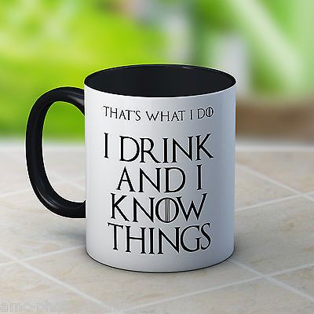

```{r echo=FALSE}
readRenviron(".Renviron")
```
  
```{r echo=FALSE, message=FALSE }
library(paws)
library(purrr)
library(readr)
library(knitr)
```
<br/><br/>
In this short lab we will have some fun with a couple of AWS AI Services. We will use the Shiny app you have just accessed and see in front of your screen to make API calls to three different AI Services in the AWS cloud. Our goal is to (1) detect text in an image, (2) translate this text into Spanish, and then (3) synthesize the text and return it as an audio file. The three houses involved in this quest are House Rekognition, House Translate and House Polly. And we will prove that you don't need to be a Maester of Deep Learning to use AI successfully. Our lab scenario looks like this:

<center>
```{r echo=FALSE, out.width = "50%"}
include_graphics("./images/lab_scenario.png")
```
</center>

**Now it is your turn!**

We start our journey with the image below. It includes a famous quote from Tyrion Lannister from GoT season 6 when the show was at its peak (Who else is still haunted by season 8?). The image was deployed with our Shiny app so we don't need to upload it again.

<center>
```{r echo=FALSE, out.width = "40%"}

```
</center>

<br/><br/>
**Step 1 - Using Amazon Rekognition**

Please press the button below which sends the image to Amazon Rekognition to detect and return the text on the coffee mug. Once our Shiny app has parsed the response from AWS Rekognition, the detected text appears below the **Send image** button.

```{r echo=FALSE}
actionButton("submitimage", "Send image", class = "btn-warning")
```

```{r echo=FALSE}
get_image_text <- eventReactive(input$submitimage, {
  image <- read_file_raw("./images/tyrion_quote.jpg")
  # Create a Rekognition client
  rekognition <- rekognition()

  # Sending the image as raw bytes
  resp <- rekognition$detect_text(
    Image = list(
    Bytes = image
  ))

# Parsing the response
parsed <- resp %>%
  .[["TextDetections"]] %>%
  keep(~.[["Type"]] == "WORD") %>%
  map_chr("DetectedText") %>%
  append(".", after = 4) %>%
  append(".", after = 11) %>%
  paste(collapse = " ")
  
})

renderText({get_image_text()})
```

<br/><br/>
**Step 2 - Using Amazon Translate**

Please copy the text Amazon Rekognition successfully identified to your clipboard: Highlight the response below the **Send image** button with your mouse and press CTRL+C. Paste the text into the **Text to translate** text box below by pressing CTRL+V.

```{r echo=FALSE}
textInput("imagetext", "Text to translate")

```

Now it is time to send the text in the **Text to translate** text box to Amazon Translate. Amazon Translate can translate text between various languages back and forth. We will translate our English text to Spanish. Once our Shiny app has parsed the response from AWS Translate, the translated text appears below the **Translate text** button. Go ahead and press it!

```{r echo=FALSE}
actionButton("translate_text_button", "Translate text", class = "btn-warning")
```

```{r echo=FALSE}
get_translation <- eventReactive(input$translate_text_button, {
  # Create Translate client
  translate <- translate()
  
  # Send text to Translate
  translated_text <- translate$translate_text(
    Text = input$imagetext,
    SourceLanguageCode = "en",
    TargetLanguageCode = "es")
  translated_text$TranslatedText
})

renderText({get_translation()})
```

<br/><br/>
**Step 3 - Using Amazon Polly**

Muy bien! Please copy the text Amazon Translate just translated into Spanish to your clipboard: Highlight the response below the **Translate text** button with your mouse and press CTRL+C. Paste the text into the **Text to convert into speech** text box below by pressing CTRL+V.

```{r echo=FALSE}
textInput("translatedtext", "Text to convert into speech")
```

We are nearly finished. We just need to send the translated Spanish text to Amazon Polly, which transforms text into lifelike speech. Amazon Polly provides a variety of different voices in multiple languages for synthesizing speech from text. We use Lupe here which is a female US Spanish (es-US) voice. Go ahead and press the **Convert to speech** button, which sends the text to Amazon Polly. Amazon Polly will respond with an .mp3 file. 

```{r echo=FALSE}
actionButton("convert_to_speech_button", "Convert to speech", class = "btn-warning")
renderText({download_message()})
```

```{r echo=FALSE}
get_audio_file <- eventReactive(input$convert_to_speech_button, {
  # Create Polly client
  polly <- polly()
  
  # Send text to Polly and parse response
  resp <- polly$synthesize_speech(
  OutputFormat = "mp3",
  Text = input$translatedtext,
  TextType = "text",
  VoiceId = "Lupe")
  
  resp[["AudioStream"]]
})

download_message <- eventReactive(get_audio_file(), {
  "MP3 file is ready to download."
})


```

<br/><br/>
**Step 4 - Listening to Lupe**

The text Amazon Polly synthesized and returned to our Shiny app is now ready to download. Press the **Download** button and listen to the result using an audio player on your machine. 

```{r echo=FALSE}
downloadHandler(
    filename = function() {
      paste("lupe-",format(Sys.time(), "%Y-%b-%d %H.%M.%S"), ".mp3", sep="")
    },
    content = function(file) {
      write_file(get_audio_file(), file)
    }
  )
```
<br/><br/>
Fell free to close the app, once you are finished
<br/><br/>
