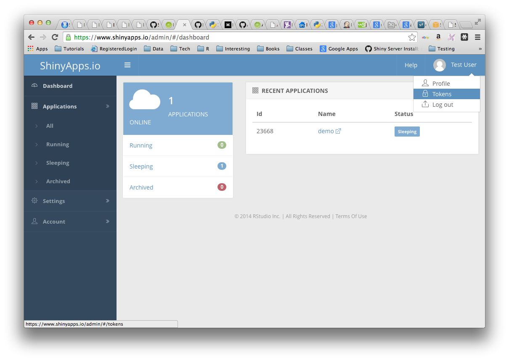

<!-- README.md is generated from README.Rmd. Please edit that file -->

```{r, include = FALSE}
knitr::opts_chunk$set(
  collapse = TRUE,
  comment = "#>"
)
```

# Third workshop module: Shiny and AWS AI Services

In the third module of the **AWS AI Services for R users** workshop you will see how quickly and easily you can add sophisticated deep learning capabilities to your Shiny applications. 

We will deploy a Shiny application to [shinyapps.io](https://shinyapps.io) which makes calls to several AWS AI services. The Shiny application leverages the AWS API calls you already know and used in the second workshop module. 

<p align="center">
```{r echo=FALSE, out.width = "45%"}
knitr::include_graphics("images/lab_scenario.png")
```
</p>

Our Shiny application is a [Shiny document](https://bookdown.org/yihui/rmarkdown/shiny-documents.html) based on a R Markdown file. Check out the source code in the [GoT_shiny_ai_services_app.Rmd file](GoT_shiny_ai_services_app.Rmd). We also deployed the app to shinyapps.io and you can access it [here](https://alexlemm.shinyapps.io/got_ai_services_lab/). In this module you will deploy your version of the app. 


## Installation

### Install the shiny package

```{r eval=FALSE}
install.packages("shiny")
```

### Modify the app-specific `.Renviron ` file

You will find another `.Renviron` file in the folder of the third workshop module. This file will be deployed with the rest of the app components. The credentials included in the file will allow the Shiny app to access the AWS AI Services via the API. 

If you trust shinyapps.io you can copy & paste the three environment variables from your user-specific `.Renviron` file you set up at the beginning to the app-specific `.Renviron` file.


```{r eval=FALSE}
AWS_ACCESS_KEY_ID = [YOUR_ACCESS_KEY_ID]
AWS_SECRET_ACCESS_KEY = [YOUR_SECRET_ACCESS_KEY]
AWS_REGION = [CHOOSE_A_REGION_ID_LIKE_us-east-1]
```

Just open your user `.Renviron` file using `usethis::edit_r_environ()` and copy the env variables. Paste them into the app `.Renviron` file, make sure sure to end the file with a new line and save it. 

If you like to use different user credentials for the app, which is actually the recommended best practice, you can set up a new user in IAM with the appropriate permissions:

* Log in to the AWS Console and navigate to IAM.

* In the left sidebar go to **Users** and click on **Add user**

* In the config menu enter a name under **User name** and select **Programmatic** access

* Click on **Next: Permissions**

* Select **Attach existing policies directly** and search and add the following three policies: `TranslateFullAccess`, `AmazonRekognitionFullAccess`, `AmazonPollyFullAccess`

* Click on **Next: Tags** then on **Next: Review** and finally on **Create user**

* Make sure to copy the **Access key ID** and the **Secret access key** and add both to the respective entries in the app `.Renviron` file


### Have a short break

After completing the setup above you are now ready to run and test the app locally. Just open `Got_shiny_ai_services_app.Rmd` in RStudio and click on **Run document** which will launch the app. 

Once you tested everything successfully, you are now ready to deploy the app to shinyapps.io. 

### Install the rsconnect package

The rsconnect package deploys applications to the shinyapps.io service. You can install it by running the R command:

```{r eval=FALSE}
install.packages('rsconnect')
```

After the rsconnect package has been installed, load it into your R session:

```{r eval=FALSE}
library(rsconnect)
```


### Set up a shinyapps.io account

Go to [shinyapps.io](https://shinyapps.io) and click “Dashboard.” The site will ask you to sign in using your email and password, your Google account, or your GitHub account.

Once you set up your account in shinyapps.io, you can configure the rsconnect package to use your account. Shinyapps.io automatically generates a token and secret for you, which the rsconnect package can use to access your account. Retrieve your token from the shinyapps.io dashboard. Tokens are listed under Tokens in the menu at the top right of the shinyapps dashboard (under your avatar).

<p align="center">
```{r echo=FALSE, out.width = "50%"}

```
</p>

Run the ‘setAccountInfo’ function from the rsconnect package passing in the token and secret from the Profile / Tokens page.

```{r eval=FALSE}
rsconnect::setAccountInfo(name="<ACCOUNT>", token="<TOKEN>", secret="<SECRET>")
```


### Deploy the app

Deploying the app from the console is fairly easy. Just execute the two commands below:

```{r eval=FALSE}
# Path to /03_GoT_Shiny_app
app_dir <- getwd()

deployApp(appDir = app_dir, appName = "got_shiny_ai_services_lab")
```

Once `rsconnect` finished the deployment it will automatically open the link to your app in the browser. 


