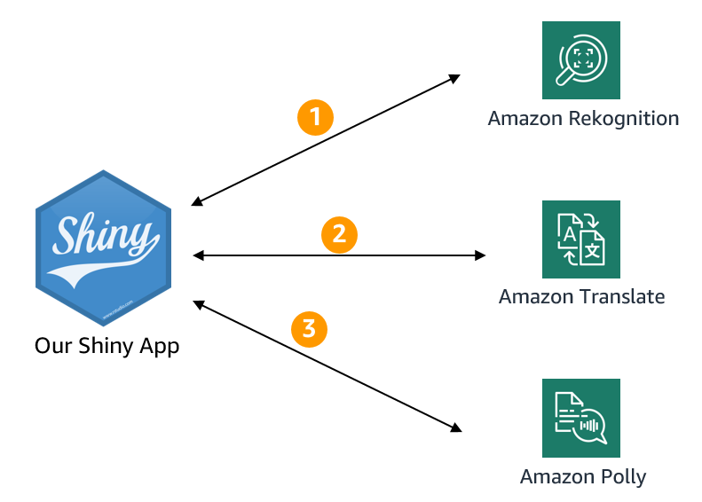

<!-- README.md is generated from README.Rmd. Please edit that file -->

```{r, include = FALSE}
knitr::opts_chunk$set(
  collapse = TRUE,
  comment = "#>"
)
```

# Third workshop module: Shiny and AWS AI Services

In the third module of the **AWS AI Services for R users** workshop you will see how quickly and easy you can add sophisticated deep learning capabilities to your Shiny applications. 

We will deploy a Shiny application which makes calls to several AWS AI services. The Shiny application leverages the AWS API calls you already know and used in the second workshop module. 

<center>
```{r echo=FALSE, out.width = "40%"}

```
</center>

Our Shiny application is a [Shiny document](https://bookdown.org/yihui/rmarkdown/shiny-documents.html) based on a R Markdown file. Check out the source code in the [GoT_shiny_ai_services_app.Rmd file](/GoT_shiny_ai_services_app.Rmd). We also deployed the app to []()https://shinyapps.io and you can access it [here](https://alexlemm.shinyapps.io/got_ai_services_lab/). In this module you will deploy your version of the app. 


## Installation

### Modify the app-specific `.Renviron ` file

You will find another `.Renviron` file in the folder of the third workshop module. This file will be deployed with the rest of the app components. It will allow the Shiny app to access the AWS AI Services via the API. 

If you trust [](https://shinyapps.io) you can copy & paste the three environment variables from your user-specific `.Renviron` file you set up at the beginning to the app-specific `.Renviron` file. Just open your user `.Renviron` file using `usethis::edit_r_environ()` and copy them. Paste them into the app `.Renviron` file, make sure sure to end the file with a new line and save it. 

If you like to use different credentials for the app you can set up a new user in IAM:

* The user only needs programmatic access
* Attach the following permissions to the user: TranslateFullAccess, AmazonRekognitionFullAccess, AmazonPollyFullAccess
* Copy the user's `Access key ID` and `Secret access key` and add both to the respective entries in the app `.Renviron` file


### Set up a shinyapps.io account


### Deploy the app

app_dir <- paste0(getwd(), "/03_GoT_Shiny_app")

deployApp(appDir = app_dir, appName = "got_ai_services_lab")

https://alexlemm.shinyapps.io/got_ai_services_lab/


