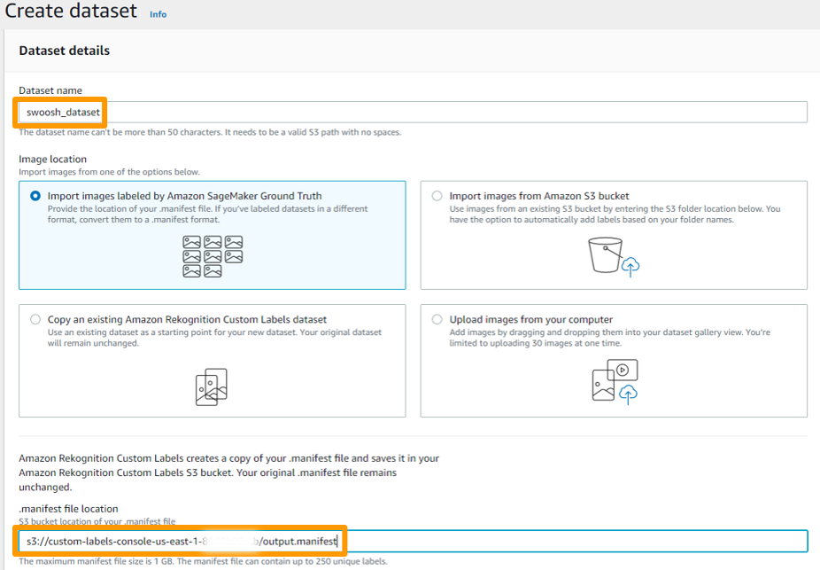

## Introduction

> **Info**
> 
> At the time of writing this article ( 20Dec20), Amazon Rekognition Custom Labels is available in 4 regions
> us-east-1 (N. Virginia), us-east-2 (Ohio), us-west-2 (Oregon), and eu-west-1 (Ireland).
> Please make sure to update the `AWS_REGION` entry in the `.Renviron` file in case you configured another AWS region. 
>
> Amazon Rekognition Custom Labels is currently also part of the AWS Free Tier which means you can get started for free:
> The [service-specific Free Tier](https://aws.amazon.com/rekognition/pricing/) lasts 3 months and includes 10 free training hours per month and 4 free inference 
> hours per month.

You can use Rekogntion Custom Labels to train your own ML models that performs image classification (image level predictions) or object detection (object/bounding box level predictions).

In this workshop module we will train an object detection model to detect the Swoosh, Nike's famous logo that Carolyn Davidson designed in 1971.

<p align="center">
```{r echo=FALSE, out.width = "40%"}
knitr::include_graphics("./images/nike_logo.png")
```


The process of using Rekognition Custom Labels to train, evaluate, deploy and use image classification or object detection models is the same and consists of the following steps:

* Step 0: Collect and preprocess your image data
* Step 1: Create a S3 Custom Labels default bucket in your region
* Step 2: Upload your dataset to S3
* Step 3: Create a Rekognition Custom Labels dataset
* Step 4: Create your project
* Step 5: Train your model
* Step 6: Evaluate the training results
* Step 7: Deploy your model
* Step 8: Make real-time predictions for new data
* Step 9: Stop your model

We will follow the steps described above to build our Swoosh detection model. Not all of the steps are supported by the Rekognition API. For those steps we will switch over to the Amazon Rekognition Custom Labels Console.  

## Load the necessary libraries 

```{r message=FALSE }
library(paws)
library(purrr)
library(readr)
library(tibble)
library(jsonlite)
library(magick)
```


## Step 0: Collect and preprocess your image data

We collected 75 free and publicly images containing the Nike Swoosh logo form [pexels.com](https://www.pexels.com/), preprocessed/scaled the images and uploaded 70 of the preprocessed images as a dataset to Kaggle that we will use for training the Swoosh detector. The remaining 5 of the pre-processed images come with this repository as a hold-out test set for making real-time predictions. The compilation below shows some of the images we collected:

<p align="center">
```{r echo=FALSE, out.width = "40%"}
knitr::include_graphics("./images/swoosh_compilation.png")
```

> **Info**
>
> The minimum and the maximum image dimension of images used for training jobs and for inference is 
> 64 pixels x 64 pixels and 4096 pixels x 4096 pixels respectively. Make sure to always scale your images 
> accordingly before you use Amazon Rekognition Custom Labels. 
>
> Additional requirements like supported image file formats, maximum image size, maximum number 
> of labels per image are described [in the official documentation here](https://docs.aws.amazon.com/rekognition/latest/customlabels-dg/limits.html).

As described above, we already did the heavy-lifting for you and pre-processed the images you will use to train and test the Swoosh detector before uploading them to Kaggle. We used the following purrr-EBImage-recipe below to do this. You can use the recipe in your future projects if you need to scale down your images below the 4096 pixels threshold. 

```{r eval=FALSE}
library(EBImage)
library(purrr)

source_folder <- "./[folder_of_images_to_be_scaled]"
target_folder <- "./[folder_to_save_scaled_images/]"

walk(file_names, function(x) {
  img <- readImage(paste0(source_folder, "/", x))
  img_dim <- dim(img)
  index <- which.max(img_dim)
  
  if(img_dim[index] > 4096) {
    scale_fct <- 4096 / img_dim[index]
    img <- resize(img, w = img_dim[1] * scale_fct, h = img_dim[2] * scale_fct)
  }
  writeImage(img, paste0(target_folder, "/", x), quality = 95)
})
```


## Step 1: Create S3 Custom Labels bucket

Creating the default S3 Custom Labels bucket is an one-time step per region in which you like to use Amazon Rekognition Custom Labels. You don't need to repeat this step afterwards. 

In the AWS Console select **Amazon Rekognition** underneath services and then select **Use Custom Labels** in the left sidebar. Click on **Get started** in the middle of the Amazon Rekognition Custom Labels Console and then on **Create S3 bucket** to create your Rekognition Custom Labels default bucket in your region:

<p align="center">
```{r echo=FALSE, out.width = "40%"}
knitr::include_graphics("./images/console/00_set_up_default_bucket.PNG")
```

You can safely ignore the prompt in the console to create your first Custom Labels project. We will do this later via the API.

Next, we create an S3 client to retrieve the name of our S3 Rekognition Custom Labels default bucket you just created. We will need the S3 bucket name later. 

```{r}
s3 <- s3()
region <- Sys.getenv("AWS_REGION")

custom_labels_bucket <- s3$list_buckets() %>% 
  .[["Buckets"]] %>% 
  map_chr("Name") %>% 
  keep(function(x) startsWith(x, paste0("custom-labels-console-", region)))

custom_labels_bucket
```

## Step 2: Upload your dataset

Now, we will create a new folder **/assets** in our S3 Custom Labels default bucket which we will use to store our raw datasets.

```{r}
s3$put_object(Bucket = custom_labels_bucket, Key = "/assets/", Body = "")
```

Next, we will switch over to the S3 Console and upload the unzipped folder **swoosh_data** of Swoosh images we downloaded from Kaggle. 

Navigate to the **/assets** folder we just created and click on **Upload**.

<p align="center">
```{r echo=FALSE, out.width = "40%"}
knitr::include_graphics("./images/console/01_select_upload.png")
```


Click on **Add folder** and select the **swoosh_data** folder on your file system. 

<p align="center">
```{r echo=FALSE, out.width = "40%"}
knitr::include_graphics("./images/console/02_select_add_folder.png")
```

**Important:** Back on the Upload page, make sure to scroll down and click on **Upload**:

<p align="center">
```{r echo=FALSE, out.width = "40%"}
knitr::include_graphics("./images/console/03_press_upload_button.png")
```

After the upload is complete, the S3 folder structure should look like this and the **/train** subfolder should contain 70 images. 

<p align="center">
```{r echo=FALSE, out.width = "40%"}
knitr::include_graphics("./images/console/04_post_S3_upload.png")
```


## Step 3: Create a Rekognition Custom Labels dataset

Next, we need to create a Rekognition Custom Labels dataset.  datasets contain the images, assigned labels, and bounding boxes that you use to train and test a custom model. You create and manage datasets by using the Amazon Rekognition Custom Labels console. You can't create a dataset with the Amazon Rekognition Custom Labels API.

We do this to create the manifest file which we need to reference in the next step when starting a training job. 
The manifest file includes the correct labels of our images. 

A Rekognition Custom Labels dataset is a "virtual" dataset that references a dataset that resides in S3. 

Now we need to register the dataset we uploaded to the S3 Custom Labels bucket in Rekognition Custom Labels. 
This step is necessary so that we can create a training job in Rekognition Custom Labels that will reference the registered data set. 

This step is not yet supported via the official API and thus nor via paws. 


### Option 1: 


### Option 2: 

Update the manifest file which comes with this workshop module. 


<p align="center">
```{r echo=FALSE, out.width = "40%"}
knitr::include_graphics("./images/console/05_upload_manifest_file.png")
```
<p align="center">
```{r echo=FALSE, out.width = "40%"}

```

<p align="center">
```{r echo=FALSE, out.width = "40%"}
knitr::include_graphics("./images/console/07_dataset_after_manifest_import.png")
```

## Step 4: Create your project

The primary purpose of a Rekognition Custom Labels projects is to manage the life cycle of your machine learning models. A trained model always belongs to one project. A project just serves as an umbrella under which you train, deploy and manage one or more ML models. 

We will create a Rekognition client and create our first Custom Labels project:

```{r}
rek <- rekognition()

project_name <- "swoosh_detector"
project_arn <- rek$create_project(project_name)
```

`create_project()` returns the project's Amazon Resource Name (ARN). We will store it in a separate variable which we will need later when defining the training job for our Swoosh detection model. 

Alternatively, you can also use the following code snipped to retrieve the entire list of your Rekognition Custom Labels projects and select the project of your choice:

```{r eval=FALSE}
rek$describe_projects() %>% 
  pluck("ProjectDescriptions") %>% 
  map_chr("ProjectArn")
```

## Step 5: Train your model

You train a model by calling `create_project_version()` which is not the most intuitive function name in this context. To train a model, the following information is needed:

Name – A unique name for the model version. !!!! That is actually the name of the MODEL and not the version!!!!! We will use version_name but be aware that this actually means name of the model in this context. 

Project ARN – The Amazon Resource Name (ARN) of the project that manages the model.

Training dataset – An SageMaker Ground Truth–formatted manifest file and images that are used to train the model. You can create the dataset in the Amazon Rekognition Custom Labels console. Another option is to provide an external manifest file such as an SageMaker Ground Truth labeling job. The dataset is stored in an Amazon S3 bucket.

Testing dataset – Test images and labels used to evaluate the model after training. You can use a dataset created in the Amazon Rekognition Custom Labels console (stored in the console's Amazon S3 bucket). Alternatively, you can use an SageMaker Ground Truth format manifest file stored in an external Amazon S3 bucket. You can also split the training dataset to use it as a testing dataset.

Training results location – The Amazon S3 location where the results are placed. You can use the same location as the console Amazon S3 bucket, or you can choose a different location. We recommend choosing a different location because this allows you to set permissions and avoid potential naming conflicts with training output from using the Amazon Rekognition Custom Labels console.

The response from CreateProjectVersion is an ARN that you use to identify the model version in subsequent requests. You can also use the ARN to secure the model version. Training a model version takes a while to complete. The Python and Java examples in this topic use waiters to wait for training to complete. A waiter is a utility method that polls for a particular state to occur. Alternatively, you can get the current status of training by calling DescribeProjectVersions. Training is completed when the Status field value is TRAINING_COMPLETED. After training is completed, you can evaluate model’s quality by reviewing the evaluation results.

```{r}
version_name <- paste0(project_name, ".", format(Sys.time(), "%Y-%m-%dT%H.%M.%S"))
manifest_location <- "datasets/swoosh_dataset/manifests/output/output.manifest"
output_folder <- paste0("output_folder/", project_name, "/",  version_name)

model_arn <- rek$create_project_version(ProjectArn = project_arn, 
                                        VersionName = version_name, 
                                        OutputConfig = list(
                                          S3Bucket = custom_labels_bucket,
                                          S3KeyPrefix = output_folder                 
                                        ),
                                        TrainingData = list(
                                          Assets = list(
                                            list(
                                              GroundTruthManifest = list(
                                                S3Object = list(
                                                  Bucket = custom_labels_bucket,
                                                  Name = manifest_location
                                                )
                                              )
                                            )
                                          )
                                        ),
                                        TestingData = list(
                                          AutoCreate = TRUE
                                        )
)
```


Use the following command to get the current status of the model training. Training is complete when the value of Status is TRAINING_COMPLETED.

Replace project_arn with the ARN of the project you created in Step 2: Create a Project. Replace version_name with the name of the version that you used in Step 4: Train Your Model.

aws rekognition describe-project-versions --project-arn "project_arn"\
     --version-names "version_name"

```{r}
training_results <- rek$describe_project_versions(ProjectArn = project_arn,
                              VersionNames = list(
                                version_name
                              )
)
training_status <- training_results %>% 
  pluck("ProjectVersionDescriptions", 1, "Status")
training_status
  
```

## Step 7: Deploy your model

```{r}

model_arn <- training_results %>% 
  pluck("ProjectVersionDescriptions", 1, "ProjectVersionArn")


rek$start_project_version(ProjectVersionArn = model_arn, 
                          MinInferenceUnits = 1 )

```

### dec12

```{r}
project_arns <- rek$describe_projects() %>% 
  pluck("ProjectDescriptions") %>% 
  map_chr("ProjectArn") 

swoosh_project <- project_arns[grepl("swoosh_detection3", project_arns)]

#rek$describe_project_versions(swoosh_project)

model_arn <- rek$describe_project_versions(swoosh_project) %>% 
  pluck("ProjectVersionDescriptions" , 1, "ProjectVersionArn")
  
```

```{r}
rek$start_project_version(ProjectVersionArn = model_arn, MinInferenceUnits = 1)
```

```{r}
#rek$describe_project_versions(project_arn, version_name) %>% 
#  pluck("ProjectVersionDescriptions", 1, "Status")

rek$describe_project_versions(swoosh_project, "swoosh_detection3.2020-11-29T20.53.55") %>% 
  pluck("ProjectVersionDescriptions", 1, "Status")
```


## Step 8: Make real-time predictions for new data

Now, we will use the 5 images of the hold-out test set that comes with this repository to test our deployed Swoosh detector model. We will test each of the following images one by one: 

<p align="center">
```{r echo=FALSE, out.width = "40%"}
knitr::include_graphics("./images/swoosh_test_set_compilation.png")
```

As you can see, images 1 and 2 contain a single Swoosh each, image 3 contains no Swoosh at all, and images 5 and 6 include the Swoosh multiple times. 

We will show you various best practices on how to parse the results from the Rekognition Custom Labels API and how to add the received bounding box coordinates to the original image for which we will use the `magick` package.

```{r}
file_names <- list.files("./images/inference/")
path_to_file <- "./images/inference/"
```

### Image 1: A single Swoosh

```{r}
file <- paste0(path_to_file, file_names[1])
image <- read_file_raw(file)

resp <- rek$detect_custom_labels(ProjectVersionArn = model_arn,
                                 Image = list(
                                   Bytes = image
                                 )
)

# Parse the result
names <- resp$CustomLabels %>% 
  map_chr("Name")
confidence <- resp$CustomLabels %>% 
  map_dbl("Confidence")

tibble(names, confidence)
```


```{r fig.align="center", out.width = "60%"}
# Convert raw image into a magick object
magick_image <- image_read(file)
image_attr <- image_info(magick_image)

# Extract bounding box information of detected object(s) from the response
bounding_box <- resp$CustomLabels[[1]]$Geometry$BoundingBox

# Calculate bounding box properties
width <- bounding_box$Width * image_attr$width 
height <- bounding_box$Height * image_attr$height
left <- bounding_box$Left * image_attr$width 
top <- bounding_box$Top * image_attr$height

# Add bounding box to image
image <- magick_image %>% 
  image_draw()
rect(left, top, left + width, top + height, border = "red", lty = "dashed", lwd = 15)
dev.off()
```

Image 2: Another single Swoosh

```{r}
file <- paste0(path_to_file, file_names[2])
image <- read_file_raw(file)

resp <- rek$detect_custom_labels(ProjectVersionArn = model_arn,
                                 Image = list(
                                   Bytes = image
                                 )
)

# Parse the result
names <- resp$CustomLabels %>% 
  map_chr("Name")
confidence <- resp$CustomLabels %>% 
  map_dbl("Confidence")

tibble(names, confidence)
```

```{r fig.align="center", out.width = "60%"}
# Convert raw image into a magick object
magick_image <- image_read(file)
image_attr <- image_info(magick_image)

# Extract bounding box information of detected object(s) from the response
bounding_box <- resp$CustomLabels[[1]]$Geometry$BoundingBox

# Calculate bounding box properties
width <- bounding_box$Width * image_attr$width 
height <- bounding_box$Height * image_attr$height
left <- bounding_box$Left * image_attr$width 
top <- bounding_box$Top * image_attr$height

# Add bounding box to image
image <- magick_image %>% 
  image_draw()
rect(left, top, left + width, top + height, border = "red", lty = "dashed", lwd = 15)
dev.off()
```
### Image 3: No Swoosh

```{r}
file <- paste0(path_to_file, file_names[3])
image <- read_file_raw(file)

resp <- rek$detect_custom_labels(ProjectVersionArn = model_arn,
                                 Image = list(
                                   Bytes = image
                                 )
)

# Parse the result
names <- resp$CustomLabels %>% 
  map_chr("Name")
confidence <- resp$CustomLabels %>% 
  map_dbl("Confidence")

tibble(names, confidence)
```

### Image 4: Multiple Swooshes

```{r}
file <- paste0(path_to_file, file_names[4])
image <- read_file_raw(file)

resp <- rek$detect_custom_labels(ProjectVersionArn = model_arn,
                                 Image = list(
                                   Bytes = image
                                 )
)

# Parse the result
names <- resp$CustomLabels %>% 
  map_chr("Name")
confidence <- resp$CustomLabels %>% 
  map_dbl("Confidence")

tibble(names, confidence)
```

Recommend to use this pure recipe

> **Info**
>
>
>


```{r fig.align="center", out.width = "60%"}
# Convert raw image into a magick object
magick_image <- image_read(file)
image_attr <- image_info(magick_image)

# Extract bounding box information of detected object(s) from the response
bounding_boxes <- resp$CustomLabels

# Calculate bounding box properties
boxes <- map_dfr(bounding_boxes, function(x) {
  bounding_box <- x[["Geometry"]][["BoundingBox"]]
  width <- bounding_box$Width * image_attr$width 
  height <- bounding_box$Height * image_attr$height
  left <- bounding_box$Left * image_attr$width 
  top <- bounding_box$Top * image_attr$height
  cords <- c(width = width, height = height, left = left, top = top)
  cords
})

# Add bounding box(es) to image
image <- magick_image %>% 
  image_draw()
rect(boxes$left, boxes$top, boxes$left + boxes$width, boxes$top + boxes$height, border = "red", lty = "dashed", lwd = 15)
dev.off()
```


### Image 5: Even more Swooshes

```{r}
file <- paste0(path_to_file, file_names[5])
image <- read_file_raw(file)

resp <- rek$detect_custom_labels(ProjectVersionArn = model_arn,
                                 Image = list(
                                   Bytes = image
                                 )
)

# Parse the result
names <- resp$CustomLabels %>% 
  map_chr("Name")
confidence <- resp$CustomLabels %>% 
  map_dbl("Confidence")

tibble(names, confidence)
```
```{r fig.align="center", out.width = "60%"}
# Convert raw image into a magick object
magick_image <- image_read(file)
image_attr <- image_info(magick_image)

# Extract bounding box information of detected object(s) from the response
bounding_boxes <- resp$CustomLabels

# Calculate bounding box properties
boxes <- map_dfr(bounding_boxes, function(x) {
  bounding_box <- x[["Geometry"]][["BoundingBox"]]
  width <- bounding_box$Width * image_attr$width 
  height <- bounding_box$Height * image_attr$height
  left <- bounding_box$Left * image_attr$width 
  top <- bounding_box$Top * image_attr$height
  cords <- c(width = width, height = height, left = left, top = top)
  cords
})

# Add bounding box(es) to image
image <- magick_image %>% 
  image_draw()
rect(boxes$left, boxes$top, boxes$left + boxes$width, boxes$top + boxes$height, border = "red", lty = "dashed", lwd = 15)
dev.off()
```

The results above show you that our Swoosh detector model does not yet work perfectly and missed to spot x out of y Swoosh logos in the image. In particular, the model missed to detect the two logos with the overhanging of the price label shoelaces and x Swoosh logos.


## Step 9: Stop your model

```{r}
resp <- rek$stop_project_version(model_arn)
```

## Summary 


