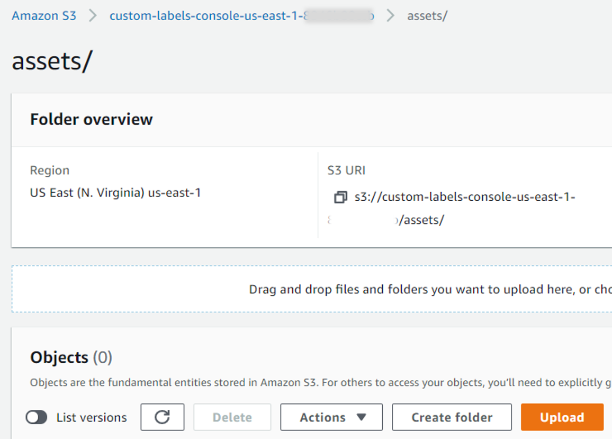
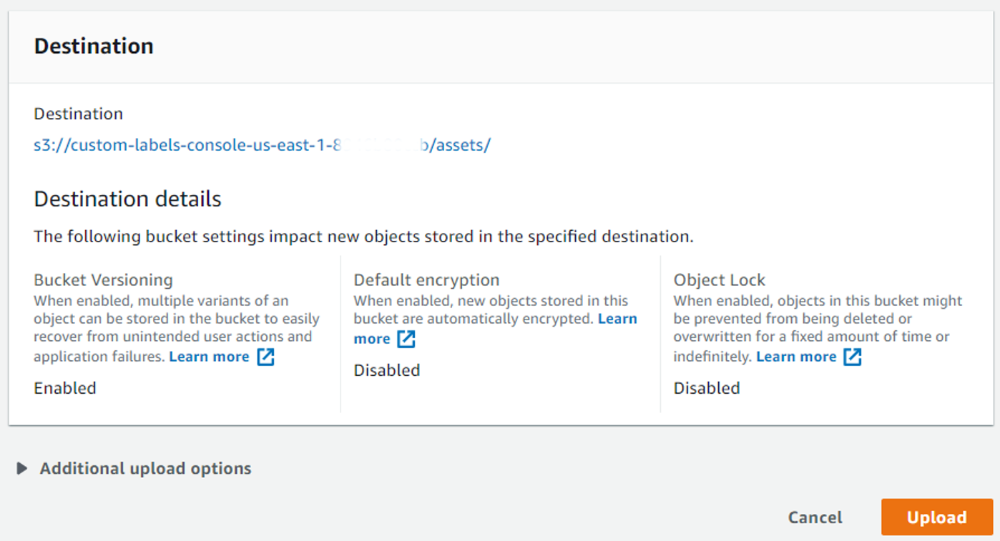
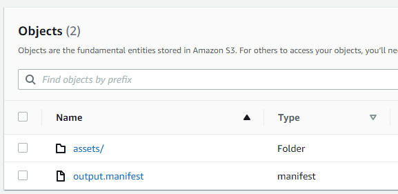
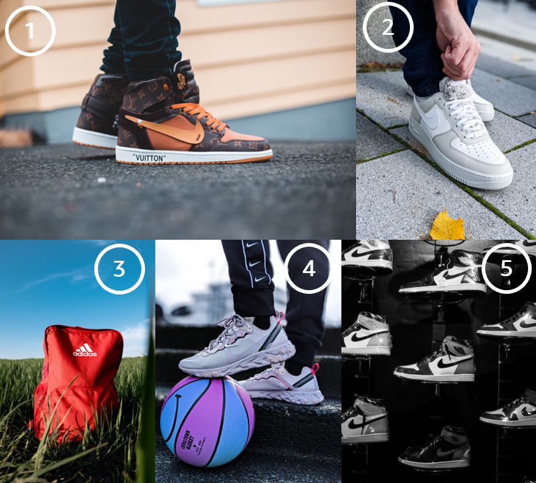

## Introduction

You can use Rekognition Custom Labels to train your own machine learning models that perform image classification (image level predictions) or object detection (object/bounding box level predictions).

In this workshop module we will train an object detection model to detect the Swoosh, Nike's famous logo that Carolyn Davidson designed in 1971.

<p align="center">
```{r echo=FALSE, out.width = "40%"}

```
</p>

The process of using Rekognition Custom Labels to train, evaluate, deploy and use image classification or object detection models is the same and consists of the following steps:

* Step 0: Collect and preprocess your image data
* Step 1: Create an S3 Rekognition Custom Labels default bucket in your region
* Step 2: Upload your dataset to S3
* Step 3: Create a Rekognition Custom Labels dataset
* Step 4: Create your project
* Step 5: Train your model
* Step 6: Evaluate the training results
* Step 7: Deploy your model
* Step 8: Make real-time predictions for new data
* Step 9: Stop your model

We will follow the steps described above to build our Swoosh detection model. Not all of the steps are supported by the Rekognition API. If necessary, we will switch over to the Amazon Rekognition Custom Labels console.  

> **Info**
> 
> At the time of writing this article in December 2020, Amazon Rekognition Custom Labels is available in 4 regions: 
> us-east-1 (N. Virginia), us-east-2 (Ohio), us-west-2 (Oregon), and eu-west-1 (Ireland).
> Please make sure to update the `AWS_REGION` entry in your `.Renviron` file in case you configured another AWS region. 
>
> Amazon Rekognition Custom Labels is currently also part of the AWS Free Tier which means you can get started for free:
> The [service-specific Free Tier](https://aws.amazon.com/rekognition/pricing/) lasts 3 months and includes 10 free 
> training hours per month and 4 free inference hours per month.


## Load the necessary libraries 

```{r message=FALSE }
library(paws)
library(purrr)
library(readr)
library(tibble)
#library(jsonlite)
library(magick)
```


## Step 0: Collect and preprocess your image data

We collected 75 free and publicly available images containing the Nike Swoosh logo from [pexels.com](https://www.pexels.com/), preprocessed/scaled the images, and uploaded 70 of the preprocessed images as a dataset to Kaggle that we will use to train the Swoosh detector model. The remaining 5 of the pre-processed images come with this repository as a hold-out test set for making real-time predictions. 

Please [navigate to the Nike Swoosh Compilation dataset](https://www.kaggle.com/alex23lemm/nike-swoosh-compilation) on Kaggle, click on the page's **Download** button,  and unzip **archive.zip** once the download is complete. 

The compilation below shows some of the images we collected:

<p align="center">
```{r echo=FALSE, out.width = "70%"}
knitr::include_graphics("./images/swoosh_compilation.png")
```
</p>


> **Info**
>
> The minimum and the maximum image dimension of images used for training jobs and for inference with 
> Rekognition Custom Labels is 64 pixels x 64 pixels and 4096 pixels x 4096 pixels respectively. 
> Always scale your images accordingly before you use Amazon Rekognition Custom Labels. 
>
> Additional requirements like supported image file formats, maximum image size, maximum number 
> of labels per image are described [in the official documentation here](https://docs.aws.amazon.com/rekognition/latest/customlabels-dg/limits.html).

We used the purrr-EBImage-recipe below to scale the images from Pexels below the 4096 pixels threshold before we uploaded them to Kaggle. You can use the recipe in your future Rekognition Custom Labels projects:

```{r eval=FALSE}
library(EBImage)
library(purrr)

source_folder <- "./[folder_of_images_to_be_scaled]"
target_folder <- "./[folder_to_save_scaled_images/]"

walk(file_names, function(x) {
  img <- readImage(paste0(source_folder, "/", x))
  img_dim <- dim(img)
  index <- which.max(img_dim)
  
  if(img_dim[index] > 4096) {
    scale_fct <- 4096 / img_dim[index]
    img <- resize(img, w = img_dim[1] * scale_fct, h = img_dim[2] * scale_fct)
  }
  writeImage(img, paste0(target_folder, "/", x), quality = 95)
})
```


## Step 1: Create S3 Rekognition Custom Labels default bucket

Creating the default S3 Rekognition Custom Labels bucket is an one-time step per region in which you like to use Amazon Rekognition Custom Labels. You don't need to repeat this step afterwards. 

In the AWS console select **Amazon Rekognition** underneath services and then select **Use Custom Labels** in the left sidebar. Click on **Get started** in the middle of the Amazon Rekognition Custom Labels console and then on **Create S3 bucket** to create your Rekognition Custom Labels default bucket in your region:

```{r echo=FALSE, out.width = "70%"}
knitr::include_graphics("./images/console/00_set_up_default_bucket.png")
```

You can safely ignore the prompt in the console to create your first Custom Labels project. We will do this later via the API.

Next, we create an S3 client to retrieve the name of our S3 Rekognition Custom Labels default bucket you just created. We will need the S3 bucket name later. 

```{r}
s3 <- s3()
region <- Sys.getenv("AWS_REGION")

custom_labels_bucket <- s3$list_buckets() %>% 
  .[["Buckets"]] %>% 
  map_chr("Name") %>% 
  keep(function(x) startsWith(x, paste0("custom-labels-console-", region)))
```

## Step 2: Upload your dataset

We will create a new folder **/assets** in our S3 Custom Labels default bucket to which we will upload the Swoosh dataset.

```{r eval=FALSE}
s3$put_object(Bucket = custom_labels_bucket, Key = "/assets/", Body = "")
```

Next, we will switch over to the S3 console and upload the unzipped folder **swoosh_data** of Swoosh images we downloaded from Kaggle. 

Navigate to the **/assets** folder we just created and click on **Upload**:

```{r echo=FALSE, out.width = "55%"}

```

Click on **Add folder** and select the **/swoosh_data** folder on your file system:

```{r echo=FALSE, out.width = "70%"}
knitr::include_graphics("./images/console/02_select_add_folder.png")
```

**Important:** Back on the Upload page, make sure to scroll down and click on **Upload**:

```{r echo=FALSE, out.width = "70%"}

```

After the upload, the S3 folder structure should look like this and the **/train** subfolder should contain 70 images:

```{r echo=FALSE, out.width = "85%"}
knitr::include_graphics("./images/console/04_post_S3_upload.png")
```


## Step 3: Create a Rekognition Custom Labels dataset

Now, We will create a Rekognition Custom Labels dataset. A Rekognition Custom Labels dataset references the training/test dataset residing in S3 and allows you to add labels/bounding box metadata to your images. The labeling process will generate a manifest file that includes (1) the respective labels/bounding box information and (2) the references to the images stored in S3. Without a manifest file we won't be able to start a Rekognition Custom Labels training job. 

You can only create Rekognition Custom Labels datasets by using the Amazon Rekognition Custom Labels console. However, instead of creating the image labels/bounding boxes from scratch which is a kind of cumbersome manual process, you can also create a Custom Labels dataset based on an existing manifest file that already includes the respective label/bounding box information of your dataset. 

And you're lucky: We already created the manifest file with the necessary information for you. This will save you approximately 30-40 minutes of your life and you won't need to draw bounding boxes yourself. 


### Step 3.1: Edit and upload the manifest file

On your machine:

* Open the manifest file **output.manifest** in **./04_Rekognition_Custom_Labels_and_R/assets/** on your machine.

* Replace the beginning of **ALL** 70 `s3://[MY_CUSTOM_LABELS_DEFAULT_BUCKET]/...` resource identifiers with the correct name of your S3 Rekognkition Custom Labels default bucket `s3://[YOUR_CUSTOM_LABELS_DEFAULT_BUCKET]/...`. Save and close the manifest file.

Navigate to the **S3 console**. Upload the updated manifest file to the root folder of your Rekognition Custom Labels default bucket:

```{r echo=FALSE, out.width = "50%"}

```

### Step 3.2: Create Custom Labels dataset based on uploaded manifest file

Navigate to the **Rekognition Custom Labels console**. Click on **Datasets** in the left sidebar and then on **Create dataset**. Specify the following: 

* **Dataset name**: swoosh_dataset

* **Image location**: Select **Import images labeled by Amazon SageMaker Ground Truth**

* **.manifest file location**: The S3 path to the manifest file we uploaded in the previous step

After that, click on **Submit** at the bottom of the page:

```{r echo=FALSE, out.width = "80%"}
knitr::include_graphics("./images/console/06_create_dataset_via_manifest_file.png")
```

### Step 3.3: Check image labels and new manifest file

In the Rekognition Custom Labels console you should find the generated Swoosh_dataset underneath **Datasets**. All 70 images of the dataset should include the respective label/bounding box information:

```{r echo=FALSE, out.width = "85%"}
knitr::include_graphics("./images/console/07_dataset_after_manifest_import.png")
```

**Important**: Using an existing manifest file to create a Custom Labels dataset will also create a NEW manifest file **output.manifest** in your Custom Labels S3 default bucket underneath `/datasets/[DATASET_NAME]/manifests/output`. This new manifest file will be the one that we'll pass as a parameter when starting the training job later. 

```{r echo=FALSE, out.width = "60%"}
knitr::include_graphics("./images/console/08_swoosh_dataset_manifest_file.png")
```


## Step 4: Create your project

Rekognition Custom Labels projects help you to manage the life cycle of your machine learning models. A trained model always belongs to one project. A project just serves as an umbrella under which you train, deploy and manage one or more image classification/object detection models. 

We will initialize a Rekognition client and create our first Custom Labels project via the API:

```{r eval=FALSE}
rek <- rekognition()

project_name <- "swoosh_detector"
project_arn <- rek$create_project(project_name)
```

`create_project()` returns the project's Amazon Resource Name (ARN). We will store it in a separate variable which we will need later when defining the training job for our Swoosh detection model. 

Alternatively, you can also use the following code snipped to retrieve the entire list of your Rekognition Custom Labels projects and select the project ARN of your choice:

```{r eval=FALSE}
rek$describe_projects() %>% 
  pluck("ProjectDescriptions") %>% 
  map_chr("ProjectArn")
```

## Step 5: Train your model

You train a model by calling `create_project_version()` which is not the most intuitive function name in this context. To train a model, the following information is needed:

* **Name**: A unique name for the model. Best practice is to use a **project name - timestamp combination** for the model name. 

* **Project ARN**: The Amazon Resource Name (ARN) of the project that will manage the model lifecycle and which we stored in `project_arn`.  

* **Training dataset**: A manifest file with the S3 location of the training image dataset and the image labeling information. This is the manifest file that was generated in `datasets/swoosh_dataset/manifests/output/output.manifest` when we created the Rekognition Custom Labels dataset in the step 3 above. 

* **Test dataset** (optional): A manifest file of the test set generated like the training set manifest file via the Rekognition Custom Labels console. If not provided, Rekognition Custom Labels creates a test dataset with a random 80/20 split of the training dataset which is the option we will use here by setting `AutoCreate = TRUE` below.

* **Training results location** – The Amazon S3 location where the training results are stored. We will store the results of training jobs in dedicated subfolders `/output_folder/[project name]/[model name]` in our S3 Rekognition Custom Labels default bucket.

> **Info**
>
> Before you start the training job by executing the code chunk below, make sure to get a coffee. 
> The training time for the Swoosh Detector model will be approximately one hour. 

```{r eval=FALSE}
model_name <- paste0(project_name, ".", format(Sys.time(), "%Y-%m-%dT%H.%M.%S"))
manifest_location <- "datasets/swoosh_dataset/manifests/output/output.manifest"
output_folder <- paste0("output_folder/", project_name, "/",  model_name)

model_arn <- rek$create_project_version(ProjectArn = project_arn, 
                                        VersionName = model_name, 
                                        OutputConfig = list(
                                          S3Bucket = custom_labels_bucket,
                                          S3KeyPrefix = output_folder                 
                                        ),
                                        TrainingData = list(
                                          Assets = list(
                                            list(
                                              GroundTruthManifest = list(
                                                S3Object = list(
                                                  Bucket = custom_labels_bucket,
                                                  Name = manifest_location
                                                )
                                              )
                                            )
                                          )
                                        ),
                                        TestingData = list(
                                          AutoCreate = TRUE
                                        )
)
```


The response from `create_project_version()` is the ARN of the trained Swoosh detector model. You will use the model ARN in subsequent API requests when deploying the trained model, making real-time predictions, and stopping the running model. 

Use the following command to get the current status of the training job. Training is complete when the status is `TRAINING_COMPLETED`.

```{r}
training_results <- rek$describe_project_versions(ProjectArn = project_arn,
                              VersionNames = list(
                                model_name
                              )
)
training_status <- training_results %>% 
  pluck("ProjectVersionDescriptions", 1, "Status")
training_status
  
```


## Step 6: Evaluate the training results

```{r}
eval_results <- training_results$ProjectVersionDescriptions[[1]] %>% 
  pluck ("EvaluationResult")
eval_results
```

```{r}
eval_summary <- s3$get_object(Bucket = custom_labels_bucket,
                              Key = eval_results$Summary$S3Object$Name,
                              ResponseContentType = "json") %>% 
  .$Body %>% 
  rawToChar() %>% 
  fromJSON()
```

```{r}
eval_summary$EvaluationDetails$NumberOfTrainingImages
eval_summary$EvaluationDetails$NumberOfTestingImages
```

```{r}
eval_summary %>% 
  pluck("LabelEvaluationResults", "Metrics") %>% 
  pivot_longer(cols = everything())
```


## Step 7: Deploy your model

Now, it is time to deploy our Swoosh detection model by calling `start_project_version()` on the Rekognition object. We will go with the minimum number of inference units. The number of inference units decide the maximum number of transactions per second (TPS) a model endpoint can support for real-time predictions. 

```{r eval=FALSE}
rek$start_project_version(ProjectVersionArn = model_arn, 
                          MinInferenceUnits = 1)
```

Use the following command to get the current deployment status. Model deployment is complete when the status is `RUNNING`.

```{r}
rek$describe_project_versions(project_arn, model_name) %>% 
  pluck("ProjectVersionDescriptions", 1, "Status")
```


## Step 8: Make real-time predictions for new data

We will use the 5 images of the hold-out test set that come with this repository to test the deployed Swoosh detector model. We will test each of the following images one by one: 

<p align="center">
```{r echo=FALSE, out.width = "70%"}

```
</p>

As you can see, images 1 and 2 contain a single Swoosh each, image 3 contains no Swoosh, and images 5 and 6 include multiple Swooshes. 

We will show you various best practices on how to parse the results from the Rekognition Custom Labels API and how to add the received bounding box coordinates to the original image using the `magick` package.

```{r}
file_names <- list.files("./images/inference/")
path_to_file <- "./images/inference/"
```

> **Info**
>
> Your prediction results might differ slightly from the  results below because the Swoosh 
> object detection model was trained based on a radom split of the training data set. 


### Image 1: A single Swoosh

We will read the first image into a raw vector and then send it to the model endpoint for prediction. Afterwards, we will parse the result into a `tibble` that will include one row per detected label with the respective label name and the confidence score.

Unlike described in [the official Rekognition Custom Labels documentation](https://boto3.amazonaws.com/v1/documentation/api/latest/reference/services/rekognition.html#Rekognition.Client.detect_custom_labels), it is NOT necessary to pass the image as base64-encoded image bytes to `detect_custom_labels()`.

```{r}
file <- paste0(path_to_file, file_names[1])
image <- read_file_raw(file)

resp <- rek$detect_custom_labels(ProjectVersionArn = model_arn,
                                 Image = list(
                                   Bytes = image
                                 )
)

# Parse the result
names <- resp$CustomLabels %>% 
  map_chr("Name")
confidence <- resp$CustomLabels %>% 
  map_dbl("Confidence")

tibble(names, confidence)
```

In total, the model detected one Swoosh in the image with a high confidence. 

Let us extract the bounding box coordinates from the response and add the bounding box to the original picture. 

```{r, 01-inference, fig.align="center", out.width = "60%", fig.path = './images/inference-results/'}
# Convert raw image into a magick object
magick_image <- image_read(file)
image_attr <- image_info(magick_image)

# Extract bounding box information of the detected object from the response
bounding_box <- resp$CustomLabels[[1]]$Geometry$BoundingBox

# Calculate bounding box properties
width <- bounding_box$Width * image_attr$width 
height <- bounding_box$Height * image_attr$height
left <- bounding_box$Left * image_attr$width 
top <- bounding_box$Top * image_attr$height

# Add bounding box to image
image <- image_draw(magick_image)
rect(left, top, left + width, top + height, border = "red", lty = "dashed", lwd = 15)
dev.off()

image <- image %>% 
  image_scale(500)

print(image)
```

Great! We see that our model detected the Swoosh in the image correctly. Let's continue!


### Image 2: Another single Swoosh

```{r}
file <- paste0(path_to_file, file_names[2])
image <- read_file_raw(file)

resp <- rek$detect_custom_labels(ProjectVersionArn = model_arn,
                                 Image = list(
                                   Bytes = image
                                 )
)

# Parse the result
names <- resp$CustomLabels %>% 
  map_chr("Name")
confidence <- resp$CustomLabels %>% 
  map_dbl("Confidence")

tibble(names, confidence)
```
In total, the model detected one Swoosh in the second image. Let us add the bounding box to the image. 

```{r, 02-inference, fig.align="center", out.width = "60%", fig.path = './images/inference-results/'}
# Convert raw image into a magick object
magick_image <- image_read(file)
image_attr <- image_info(magick_image)

# Extract bounding box information of the detected object from the response
bounding_box <- resp$CustomLabels[[1]]$Geometry$BoundingBox

# Calculate bounding box properties
width <- bounding_box$Width * image_attr$width 
height <- bounding_box$Height * image_attr$height
left <- bounding_box$Left * image_attr$width 
top <- bounding_box$Top * image_attr$height

# Add bounding box to image
image <- magick_image %>% 
  image_draw(res = 50)
rect(left, top, left + width, top + height, border = "red", lty = "dashed", lwd = 15)
dev.off()

image <- image %>% 
  image_scale(500)

print(image)
```

The model also detected this Swoosh correctly. 


### Image 3: No Swoosh

When Rekognition Custom Labels does not find a matching label in the image, it returns an empty response. The third image does not contain any Swoosh so the expected and parsed prediction result would be an empty tibble. 


```{r}
file <- paste0(path_to_file, file_names[3])
image <- read_file_raw(file)

resp <- rek$detect_custom_labels(ProjectVersionArn = model_arn,
                                 Image = list(
                                   Bytes = image
                                 )
)

# Parse the result
names <- resp$CustomLabels %>% 
  map_chr("Name")
confidence <- resp$CustomLabels %>% 
  map_dbl("Confidence")

tibble(names, confidence)
```

The result shows that the model also got this prediction correctly. 


### Image 4: Multiple Swooshes

Our fourth image of the hold-out test set includes 4 Swooshes.

```{r}
file <- paste0(path_to_file, file_names[4])
image <- read_file_raw(file)

resp <- rek$detect_custom_labels(ProjectVersionArn = model_arn,
                                 Image = list(
                                   Bytes = image
                                 )
)

# Parse the result
names <- resp$CustomLabels %>% 
  map_chr("Name")
confidence <- resp$CustomLabels %>% 
  map_dbl("Confidence")

tibble(names, confidence)
```

The parsed response shows that 4 Swooshes were detected in the image with a high confidence score.
We will now add the correspondent bounding boxes to the original image. 

> **Info**
> 
> The `purrr`-`magick` recipe below allows you to extract the coordindates of ALL bounding boxes
> included in a Rekognition Custom Labels prediction response and add them to the original 
> image. You can also use it for parsing results with a single label match. 


```{r, 04-inference, fig.align="center", out.width = "60%", fig.path = './images/inference-results/'}
# Convert raw image into a magick object
magick_image <- image_read(file)
image_attr <- image_info(magick_image)

# Extract bounding box information of detected objects from the response
bounding_boxes <- resp$CustomLabels

# Calculate bounding box properties
boxes <- map_dfr(bounding_boxes, function(x) {
  bounding_box <- x[["Geometry"]][["BoundingBox"]]
  width <- bounding_box$Width * image_attr$width 
  height <- bounding_box$Height * image_attr$height
  left <- bounding_box$Left * image_attr$width 
  top <- bounding_box$Top * image_attr$height
  cords <- c(width = width, height = height, left = left, top = top)
  cords
})

# Add bounding boxes to image
image <- magick_image %>% 
  image_draw()
rect(boxes$left, boxes$top, boxes$left + boxes$width, boxes$top + boxes$height, border = "red", lty = "dashed", lwd = 15)
dev.off()

image <- image %>% 
  image_scale(500)

print(image)
```

The model  detected all Swooshes in the image correctly. 


### Image 5: Even more Swooshes

Our final image from the hold-out test set contains 9 Swooshes in total. Let us see if our model will be able to detect all of them. 

```{r}
file <- paste0(path_to_file, file_names[5])
image <- read_file_raw(file)

resp <- rek$detect_custom_labels(ProjectVersionArn = model_arn,
                                 Image = list(
                                   Bytes = image
                                 )
)

# Parse the result
names <- resp$CustomLabels %>% 
  map_chr("Name")
confidence <- resp$CustomLabels %>% 
  map_dbl("Confidence")

tibble(names, confidence)
```

Surprisingly, the model response shows 10 detected Swooshes. Let us add the bounding boxes. 


```{r, 05-inference, fig.align="center", out.width = "60%", fig.path = './images/inference-results/'}
# Convert raw image into a magick object
magick_image <- image_read(file)
image_attr <- image_info(magick_image)

# Extract bounding box information of detected objects from the response
bounding_boxes <- resp$CustomLabels

# Calculate bounding box properties
boxes <- map_dfr(bounding_boxes, function(x) {
  bounding_box <- x[["Geometry"]][["BoundingBox"]]
  width <- bounding_box$Width * image_attr$width 
  height <- bounding_box$Height * image_attr$height
  left <- bounding_box$Left * image_attr$width 
  top <- bounding_box$Top * image_attr$height
  cords <- c(width = width, height = height, left = left, top = top)
  cords
})

# Add bounding boxes to image
image <- magick_image %>% 
  image_draw()
rect(boxes$left, boxes$top, boxes$left + boxes$width, boxes$top + boxes$height, border = "red", lty = "dashed", lwd = 15)
dev.off()

image <- image %>% 
  image_scale(500)

print(image)
```

The visualized bounding boxes above in the image show the reason why the model detected 10 Swooshes in an image with only 9 Swooshes: One of the Swooshes was detected and counted twice by the model.


## Step 9: Stop your model

After we used the hold-out test set for making real-time predictions, we will now stop our deployed model by calling `stop_project_version()`:

```{r eval=FALSE}
rek$stop_project_version(model_arn)
```
The model stopped running when the returned status is `STOPPED`.

```{r}
rek$describe_project_versions(project_arn, model_name) %>% 
  pluck("ProjectVersionDescriptions", 1, "Status")
```
You can always re-start a stopped model by calling `start_project_version()`:

```{r eval=FALSE}
rek$start_project_version(ProjectVersionArn = model_arn, 
                          MinInferenceUnits = 1 )
```


## Summary 


