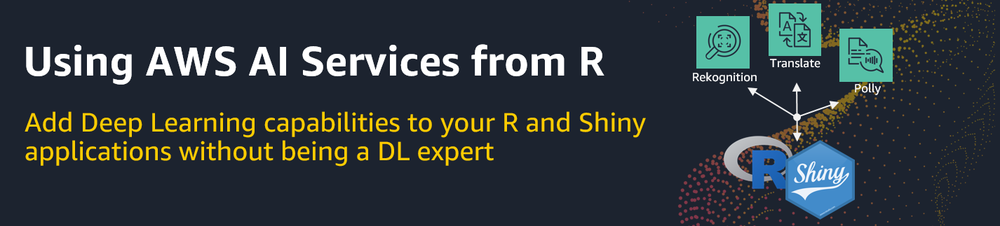

# AWS AI Services for R users

 

---

**AWS AI Services for R users** is a fun and short-lived workshop for experienced R users with no prior knowledge of AWS's AI Services, who want to add Deep Learning capabilities like image recognition, text translation or text-to-speech conversion to their R and Shiny applications. 

In all the examples we will utilize the fabulous [paws package](https://github.com/paws-r/paws), an AWS SDK for R, created by [David Kretch](https://github.com/davidkretch) and [Adam Banker](https://github.com/adambanker). `paws` provides access to the full suite of AWS services from within R similar to what `boto3`, an AWS SDK for Python, does for Python users. 

## Workshop modules

Each workshop module consists of an R Notobook (.Rmd file) so that users can run and experiment with the code examples using their RStudio installation. 


## Prerequisites 

**AWS Cloud**

* It is a plus if workshop attendees have some basic familiarity with the AWS Console.

* Every workshop attendee needs to have access to an AWS account using an IAM user. [AWS Free Tier](https://aws.amazon.com/de/free/) does also work for this workshop.

* The IAM user needs to come with security credentials (Access key ID, Secret access key) that allows him to make secure requests to AWS service APIs. 

**Local installations & configuration**

* [R](https://cran.r-project.org/) and [RStudio Desktop](https://rstudio.com/products/rstudio/download/)

* [Git](https://git-scm.com/downloads)

* Install `paws` from CRAN using `install.packages("paws") ` and set the following environment variables in your `.Renviron` file which is easiest to do using `usethis::edit_r_environ()`:

```{r}
AWS_ACCESS_KEY_ID = [YOUR_ACCESS_KEY_ID]
AWS_SECRET_ACCESS_KEY = [YOUR_SECRET_ACCESS_KEY]
AWS_REGION = [CHOOSE_A_REGION_ID_LIKE_us-east-1]
```

## Workshop installation & start

* Git clone this repo on your machine: `git clone https://github.com/alex23lemm/AWS-AI-Services-R-Workshop.git`.

* Click on `aws-ai-services-r-workshop.Rproj` and open the project in RStudio.

* Open the first R notebook contained in the `01 - Rekognition with R` folder and follow along.

* Have fun!


## What's next?

You are interested in using other AWS AI/ML related services from R like Amazon SageMaker? Please find below additional resources that will help you on your journey: 

* The [SageMaker Fundamentals for R users](https://github.com/alex23lemm/AWS-SageMaker-Fundamentals-R-Workshop) workshop:
  * Workshop for experienced R users with no prior Amazon SageMaker knowledge, who want to use their own (local) RStudio installation as an alternative to SageMaker Notebooks to connect to SageMaker to train, tune, evaluate, deploy and monitor machine learning models in the cloud.
  * You will gain a solid understanding of the underlying SageMaker fundamentals, such as what happens behind the scenes when a training, tuning job or batch inference job is started.
  * You will learn R recipes and best practices on how to parse and visualize the responses returned from Amazon SageMaker in the different stages of the machine learning process. 


* The [Using R in SageMaker](https://github.com/nickminaie/AWS-SageMaker-R-Workshop) workshop:
  * This workshop can be seen as a follow-up to the *SageMaker Fundamentals for R users* workshop.
  * In the majority of its modules you will use SageMaker Notebooks with an R kernel instead of RStudio to explore the data and to start the various SageMaker jobs.
  * Besides other topics, the workshop will teach you how to bring your own R algorithm to SageMaker, how to connect to an Elastic Map Reduce cluster using the sparklyr package to process Spark (ML) jobs or how to create a persistent custom R environment for SageMaker.

* The official SageMaker documentation: [R User Guide to Amazon SageMaker](https://docs.aws.amazon.com/sagemaker/latest/dg/r-guide.html)


## Disclaimer

* The content provided in this repository is for demonstration purposes and not meant for production. You should use your own discretion when using the content.
* The ideas and opinions outlined in these examples are my own and do not represent the opinions of AWS.


<!-- badges: end -->

The goal of aws-ai-services-r-workshop is to ...

